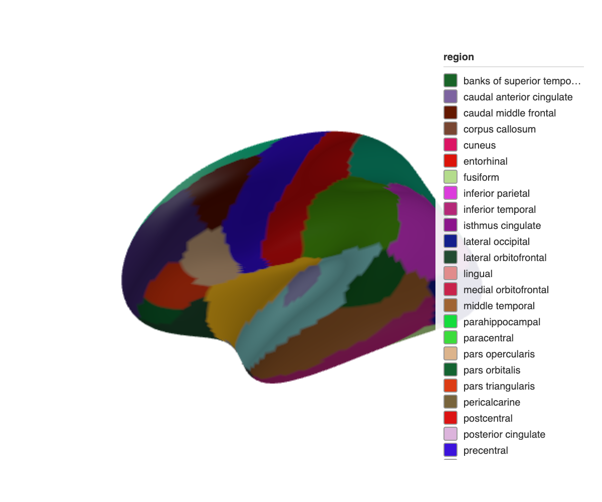
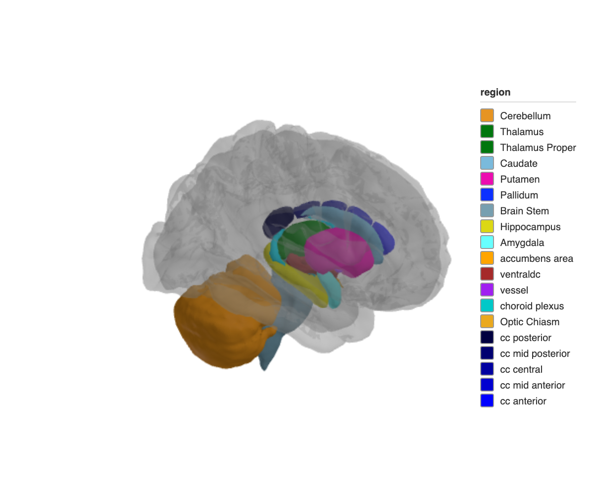

# ggseg3d 

<!-- badges: start -->

[](https://github.com/ggsegverse/ggseg3d/actions/workflows/test-coverage.yaml)
[](https://CRAN.R-project.org/package=ggseg3d)
[](https://r-pkg.org/pkg/ggseg3d)
[](https://lifecycle.r-lib.org/articles/stages.html)
[](https://github.com/ggsegverse/ggseg3d/actions/workflows/code-quality.yaml)
[](https://github.com/ggsegverse/ggseg3d/actions/workflows/R-CMD-check.yaml)
<!-- badges: end -->

Interactive 3D brain atlas visualization in R. Plot brain parcellations
as WebGL meshes powered by Three.js, or render publication-quality
static images through rgl and rayshader. A pipe-friendly API lets you
map data onto brain regions, control camera angles, toggle region edges,
overlay glass brains, and snapshot the result.

## Installation

Install from CRAN:

``` r
install.packages("ggseg3d")
```

Or get the development version from the [ggsegverse
r-universe](https://ggsegverse.r-universe.dev):

``` r
options(
  repos = c(
    ggsegverse = "https://ggsegverse.r-universe.dev",
    CRAN = "https://cloud.r-project.org"
  )
)
install.packages("ggseg3d")
```

## Atlases

Three atlases ship with the package (via
[ggseg.formats](https://ggsegverse.github.io/ggseg.formats/)):

1.  `dk` – Desikan-Killiany cortical atlas
2.  `aseg` – Automatic subcortical segmentation
3.  `tracula` – White-matter tract atlas

Additional atlases are available through the [ggsegverse
r-universe](https://ggsegverse.r-universe.dev).

## Usage

``` r
ggseg3d(atlas = dk(), hemisphere = "left") |>
  pan_camera("left lateral")
```



Subcortical structures with a translucent glass brain overlay:

``` r
ggseg3d(atlas = aseg()) |>
  add_glassbrain() |>
  pan_camera("right lateral")
```



See the [package website](https://ggsegverse.github.io/ggseg3d/) for the
full walkthrough, rayshader rendering, and Shiny integration.

## Citation

Mowinckel & Vidal-Piñeiro (2020). *Visualization of Brain Statistics
With R Packages ggseg and ggseg3d.* Advances in Methods and Practices in
Psychological Science.
[doi:10.1177/2515245920928009](https://doi.org/10.1177/2515245920928009)

## Funding

This tool is partly funded by:

**EU Horizon 2020 Grant:** Healthy minds 0-100 years: Optimising the use
of European brain imaging cohorts (Lifebrain).

**Grant agreement number:** 732592.

**Call:** Societal challenges: Health, demographic change and well-being
