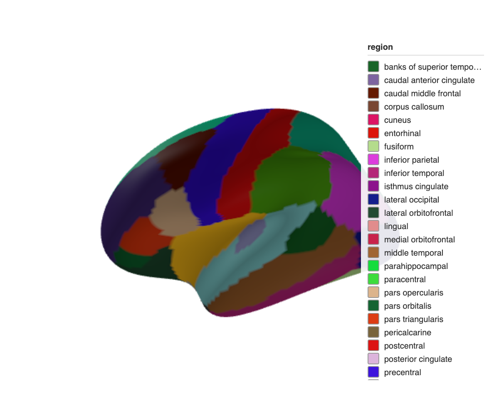
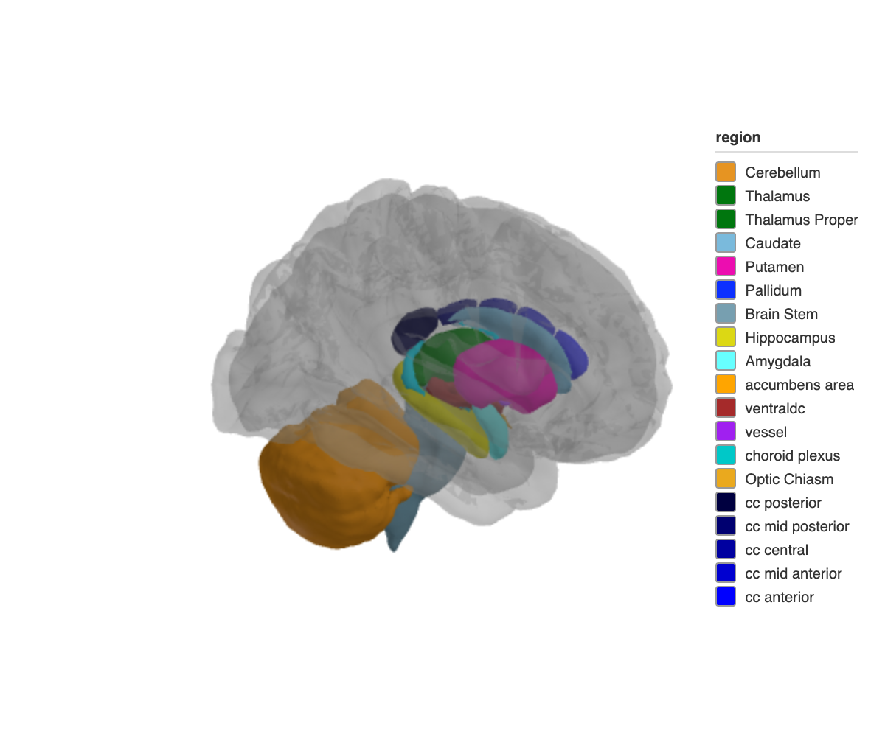

# ggseg3d 

<!-- badges: start -->
[](https://CRAN.R-project.org/package=ggseg3d)
[](https://github.com/ggseg/ggseg3d/actions)
[](https://codecov.io/gh/ggseg/ggseg3d)
[](https://r-pkg.org/pkg/ggseg3d)
[](https://lifecycle.r-lib.org/articles/stages.html)
<!-- badges: end -->

ggseg3d plots brain atlases as interactive 3D meshes, powered by Three.js.
Map data onto brain regions, control camera angles, add region edges, overlay
glass brains, and pipe everything together in a single chain.
For publication figures, `ggsegray()` renders the same atlases through rgl
and rayshader's path tracer.

## Installation

Install from the ggseg r-universe:

``` r
options(repos = c(
  ggseg = "https://ggseg.r-universe.dev",
  CRAN = "https://cloud.r-project.org"
))

install.packages("ggseg3d")
```

Or install the development version from GitHub:

``` r
# install.packages("pak")
pak::pak("ggseg/ggseg3d")
```

## Quick start

``` r
library(ggseg3d)

ggseg3d() |>
  pan_camera("left lateral")
```



Map data onto regions by passing a data frame with a `region` column:

``` r
library(dplyr)

some_data <- tibble(
  region = c("precentral", "postcentral", "insula", "superior parietal"),
  p = c(0.01, 0.04, 0.2, 0.5)
)

ggseg3d(.data = some_data, colour = "p", text = "p") |>
  pan_camera("right lateral")
```

Subcortical structures work the same way. Add a glass brain for context:

``` r
ggseg3d(atlas = aseg) |>
  add_glassbrain() |>
  pan_camera("right lateral")
```



## Pipe functions

After `ggseg3d()`, pipe into any combination of:

| Function | What it does |
|---|---|
| `pan_camera()` | Set the viewing angle (preset or custom) |
| `set_background()` | Change the background colour |
| `set_edges()` | Draw region boundary lines |
| `add_glassbrain()` | Overlay a translucent cortical surface |
| `set_legend()` | Show or hide the colour legend |
| `set_dimensions()` | Set widget width and height |
| `set_flat_shading()` | Disable lighting for exact colour match |
| `set_orthographic()` | Switch to orthographic projection |
| `snapshot_brain()` | Save a static PNG (requires Chrome) |

## Ray-traced rendering

For publication figures with realistic lighting and shadows, `ggsegray()`
renders to rgl instead of the browser. From there, hand the scene to
rayshader:

``` r
library(rgl)
library(rayshader)

ggsegray(.data = some_data, atlas = dk, colour = "p", hemisphere = "left") |>
  pan_camera("left lateral") |>
  set_background("white")

render_highquality(filename = "brain.png", samples = 256)
close3d()
```

The same pipe functions (`pan_camera()`, `add_glassbrain()`, `set_background()`)
work with both backends.
See `vignette("rayshader", package = "ggseg3d")` for the full walkthrough.

## Atlases

ggseg3d ships with three atlases:

- **dk** -- Desikan-Killiany cortical parcellation
- **aseg** -- Automatic subcortical segmentation
- **tracula** -- TRACULA white matter tracts

Many more are available through the [ggseg r-universe](https://ggseg.r-universe.dev):

``` r
install.packages("ggsegYeo2011", repos = "https://ggseg.r-universe.dev")
```

See [ggsegExtra](https://ggseg.github.io/ggsegExtra/) for the full list and
instructions on creating custom atlases.

## Shiny

ggseg3d widgets work in Shiny apps with `ggseg3dOutput()` / `renderGgseg3d()`.
See `vignette("shiny", package = "ggseg3d")`.

## Issues and requests

Report bugs or request features on [GitHub Issues](https://github.com/ggseg/ggseg3d/issues).

## Funding

This tool is partly funded by:

**EU Horizon 2020 Grant:** Healthy minds 0-100 years: Optimising the use
of European brain imaging cohorts (Lifebrain).

**Grant agreement number:** 732592.

**Call:** Societal challenges: Health, demographic change and well-being
