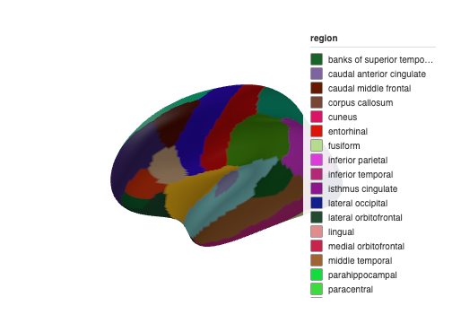
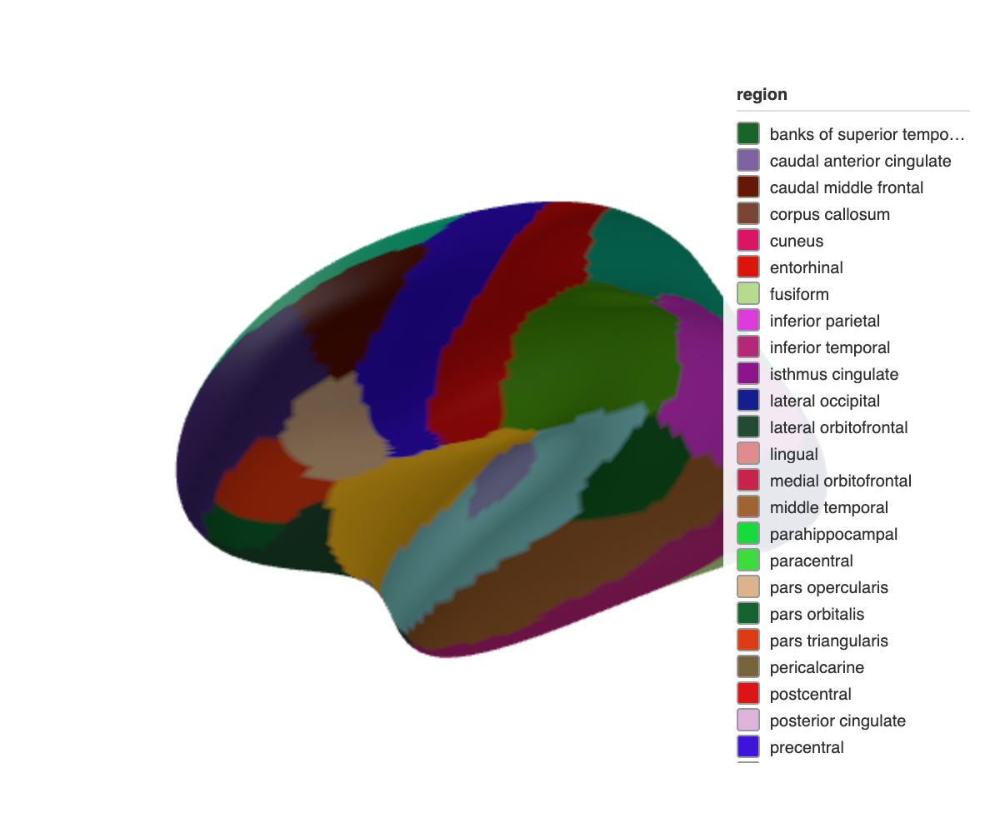
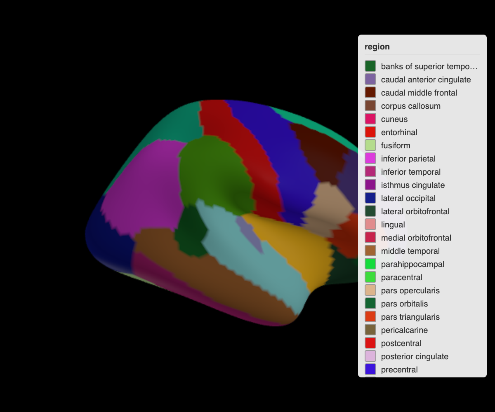
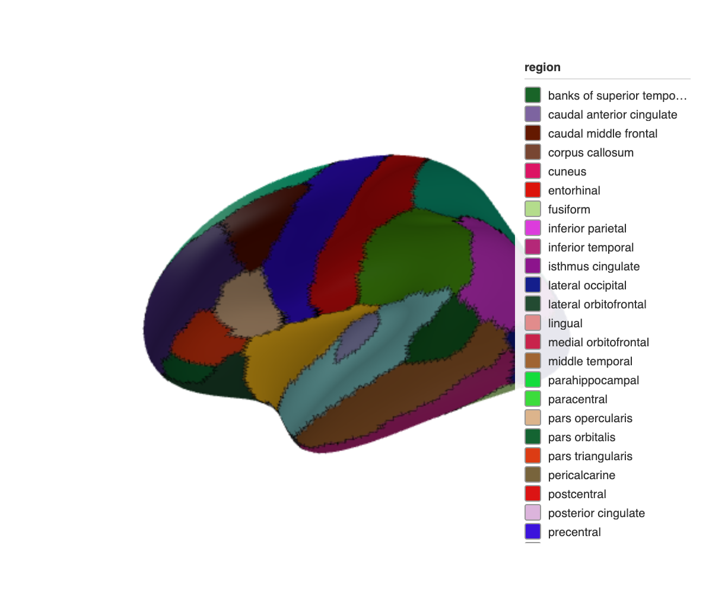
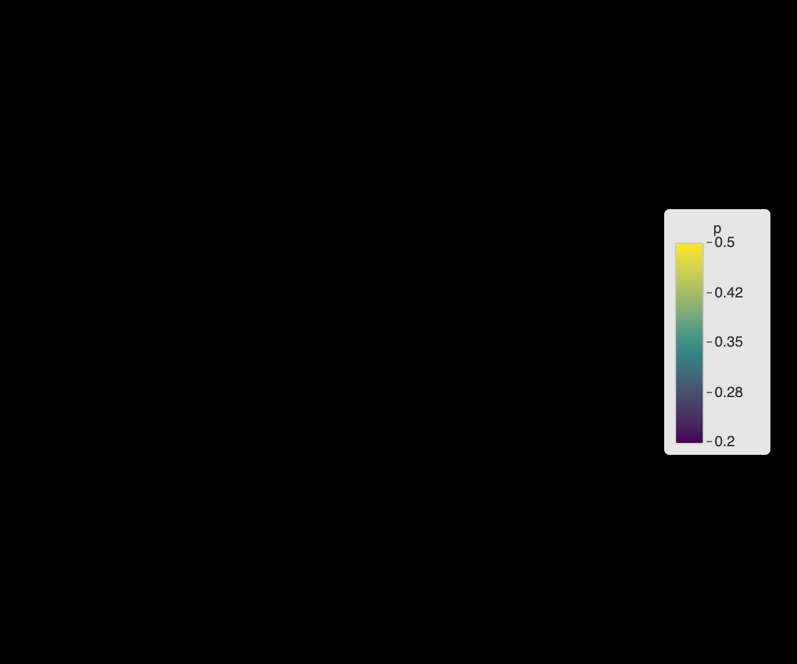
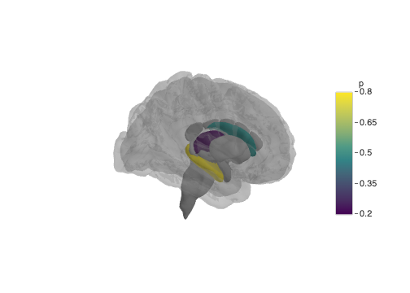
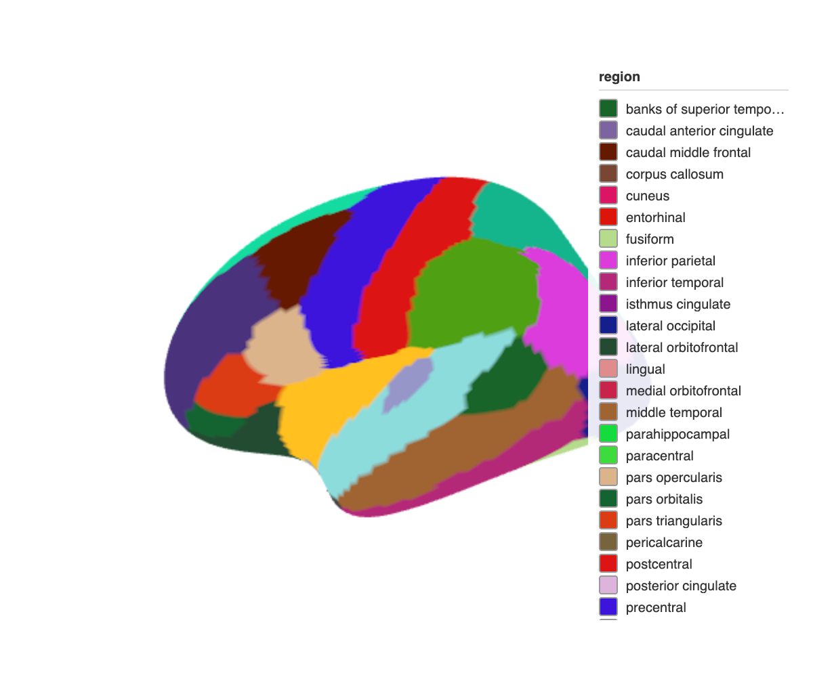
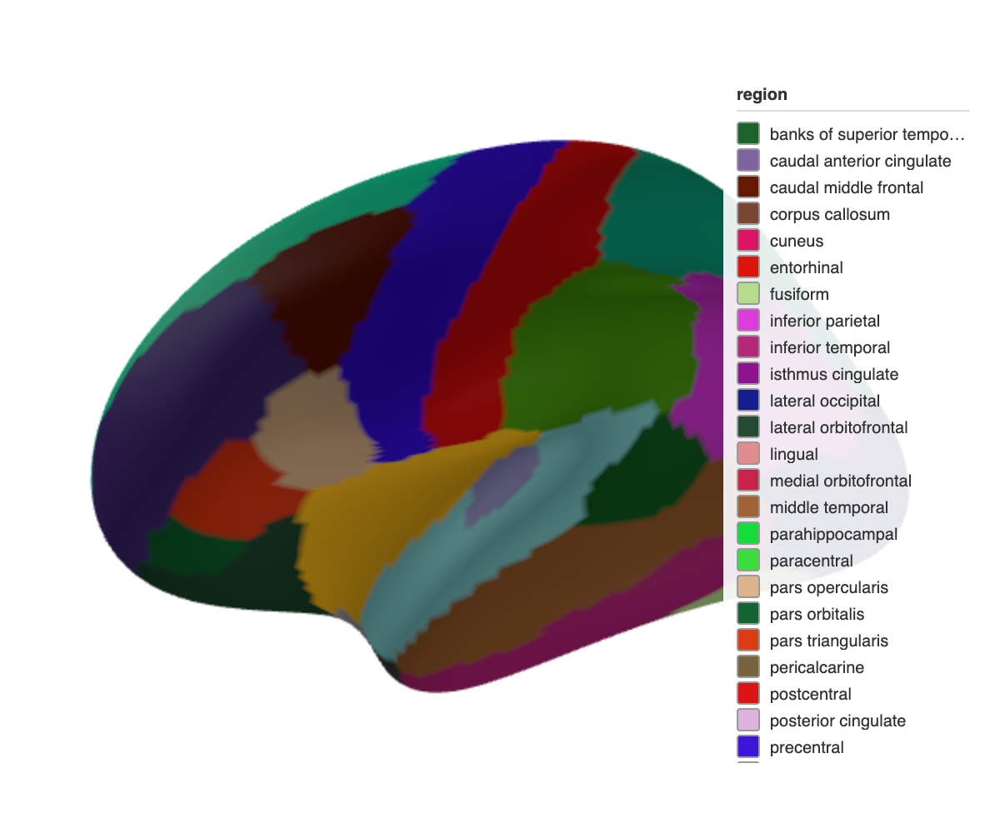

ggseg3d renders interactive 3D brain atlases using WebGL.
Version 2.0 rebuilt the package on Three.js, replacing the previous Plotly backend.
This brings faster rendering, a pipe-friendly API, and unified brain atlases that work with both ggseg and ggseg3d.

## Basic usage

Call `ggseg3d()` without arguments to plot the Desikan-Killiany atlas:


``` r
ggseg3d(hemisphere = "left") |>
  pan_camera("left lateral")
```



The widget is interactive:
- **Rotate**: click and drag
- **Zoom**: scroll wheel
- **Pan**: right-click and drag

Hover over regions to see their names.

## Camera positions

Use `pan_camera()` to set the viewing angle:


``` r
ggseg3d() |>
  pan_camera("left lateral")
```


<div class="figure">

<p class="caption">Left lateral view of the Desikan-Killiany atlas.</p>
</div>

Available presets:
- `left lateral`, `right lateral`
- `left medial`, `right medial`
- `left superior`, `right superior`
- `left inferior`, `right inferior`
- `left anterior`, `right anterior`
- `left posterior`, `right posterior`

For custom positions, pass a list:


``` r
ggseg3d() |>
  pan_camera(list(eye = list(x = -200, y = 100, z = 100)))
```

## Plotting your data

Provide data with a `region` or `label` column matching the atlas.
Map it to `colour` for the fill and optionally `text` for hover info:


``` r
some_data <- tibble(
  region = c("precentral", "postcentral", "insula", "superior parietal"),
  p = c(0.01, 0.04, 0.2, 0.5)
)

ggseg3d(.data = some_data, atlas = dk, colour = "p", text = "p") |>
  pan_camera("right lateral")
```


<div class="figure">

<p class="caption">Brain regions coloured by p-value.</p>
</div>

## Custom colour palettes

Pass colours as a vector:


``` r
ggseg3d(
  .data = some_data,
  atlas = dk,
  colour = "p",
  palette = c("forestgreen", "white", "firebrick")
)
```

Or use a named vector to control breakpoints:


``` r
ggseg3d(
  .data = some_data,
  atlas = dk,
  colour = "p",
  text = "p",
  palette = c("forestgreen" = 0, "white" = .05, "firebrick" = 1)
)
```


<div class="figure">

<p class="caption">Custom green-white-red palette with breakpoints at 0, 0.05, and 1.</p>
</div>

This lets the colour bar extend beyond your data range.

## Background colour

Change the background with `set_background()`:


``` r
ggseg3d() |>
  set_background("black")
```


<div class="figure">

<p class="caption">Brain atlas with a black background.</p>
</div>

## Region edges

> **Experimental.** Edge rendering works in the htmlwidget viewer but rgl
> support (`ggsegray`) is still unreliable across platforms. Expect rough
> edges (pun intended).

Add outlines around regions with `set_edges()`:


``` r
ggseg3d(hemisphere = "left") |>
  set_edges("black", width = 10) |>
  pan_camera("left lateral")
```


<div class="figure">

<p class="caption">Left hemisphere with black region boundary edges.</p>
</div>

### Edge boundaries with edge_by

By default, edges appear between regions with different colours.
Use `edge_by` to define boundaries based on a different column:


``` r
lobe_data <- tibble(
  region = c("precentral", "postcentral", "insula", "superior parietal"),
  p = c(0.2, 0.4, 0.3, 0.5),
  lobe = c("frontal", "parietal", "insula", "parietal")
)

ggseg3d(.data = lobe_data, atlas = dk, colour = "p", edge_by = "lobe") |>
  set_edges("white", width = 1) |>
  set_background("black")
```


<div class="figure">

<p class="caption">Lobe-based edge boundaries on a dark background.</p>
</div>

Regions in the same lobe won't have edges between them.

## Subcortical structures

For subcortical atlases, reduce opacity of uncoloured regions and add a glass brain:


``` r
subcort_data <- tibble(
  region = c("thalamus", "caudate", "hippocampus"),
  p = c(0.2, 0.5, 0.8)
)

ggseg3d(
  .data = subcort_data,
  atlas = aseg,
  colour = "p",
  text = "p",
  na_alpha = .5
) |>
  add_glassbrain()
```



The glass brain adds a translucent cortical surface for anatomical context.

## Saving images

Use `snapshot_brain()` to save static images:


``` r
ggseg3d() |>
  pan_camera("left lateral") |>
  snapshot_brain("brain_lateral.png")
```

This requires Chrome or Chromium.

### Publication-quality settings

For journal figures, increase resolution:


``` r
ggseg3d(.data = some_data, atlas = dk, colour = "p") |>
  pan_camera("left lateral") |>
  set_background("white") |>
  snapshot_brain(
    "figure1_brain.png",
    width = 1200,
    height = 1000,
    zoom = 3,
    delay = 2
  )
```

- **width/height**: Output dimensions in pixels
- **zoom**: Resolution multiplier (2-3 for print)
- **delay**: Seconds to wait for rendering

### Multi-panel figures

Save individual views and combine them:


``` r
library(magick)

base_plot <- ggseg3d(.data = some_data, atlas = dk, colour = "p") |>
  set_background("white")

base_plot |>
  pan_camera("left lateral") |>
  snapshot_brain("left_lat.png")
base_plot |>
  pan_camera("left medial") |>
  snapshot_brain("left_med.png")
base_plot |>
  pan_camera("right lateral") |>
  snapshot_brain("right_lat.png")
base_plot |>
  pan_camera("right medial") |>
  snapshot_brain("right_med.png")

panels <- image_read(c(
  "left_lat.png",
  "left_med.png",
  "right_lat.png",
  "right_med.png"
))
combined <- image_montage(panels, geometry = "600x500", tile = "2x2")
image_write(combined, "figure1_all_views.png")
```

## Legend control

Hide the legend:


``` r
ggseg3d() |>
  set_legend(FALSE)
```

## Widget dimensions

Set explicit width and height:


``` r
ggseg3d() |>
  set_dimensions(width = 800, height = 600)
```

## Flat shading

Disable lighting for exact colour reproduction:


``` r
ggseg3d() |>
  set_flat_shading()
```


<div class="figure">

<p class="caption">Flat shading disables lighting for exact colour reproduction.</p>
</div>

This is useful when creating atlases or when you need colours to match exactly.

## Orthographic projection

Switch from perspective to orthographic projection:


``` r
ggseg3d() |>
  set_orthographic()
```


<div class="figure">

<p class="caption">Orthographic projection --- regions appear the same size regardless of distance.</p>
</div>

## Same atlas for 2D and 3D

The `brain_atlas` class works with both ggseg and ggseg3d.
Use the same atlas object for both:


``` r
library(ggseg)

plot(dk)

ggseg3d(atlas = dk)
```
