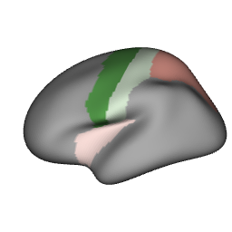
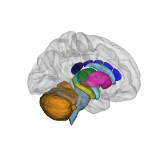
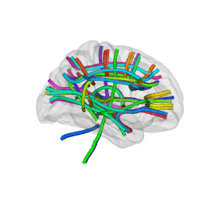
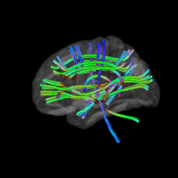
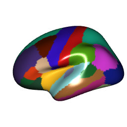
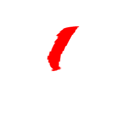
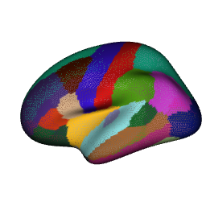

```{r}
#| label: ray-setup
#| include: false
knitr::opts_chunk$set(message = FALSE)
library(ggseg3d)
library(dplyr)
dir.create("img", showWarnings = FALSE)
options(rgl.useNULL = TRUE)

some_data <- tibble(
  region = c("precentral", "postcentral", "insula", "superior parietal"),
  p = c(0.01, 0.04, 0.2, 0.5)
)
```

Screenshots from a WebGL viewer get the job done for presentations, but journals and posters deserve better.
`ggsegray()` renders brain atlases into an rgl scene — the same mesh data, the same colour pipeline, just a different backend.
Once the scene is in rgl, rayshader's path tracer handles realistic lighting, soft shadows, and depth of field.

This vignette walks through the full workflow: from a basic rgl scene to a polished ray-traced figure.

## Setup

rgl provides the 3D scene, rayshader provides the ray tracer.
Both are optional dependencies — ggseg3d checks for them at runtime.

```{r}
#| label: ray-load
#| eval: false
library(ggseg3d)
library(dplyr)

# install.packages(c("rgl", "rayshader")) # nolint: commented_code_linter
```

## A first render

`ggsegray()` mirrors the `ggseg3d()` API for atlas, hemisphere, and colour mapping.
The difference: instead of an htmlwidget, you get an rgl window.
Camera, background, glass brain overlays — all of that comes through the same pipe functions you already know from the widget side.

```{r}
#| label: ray-first
#| eval: false
ggsegray(atlas = dk(), hemisphere = "left") |>
  pan_camera("left lateral")

rgl::snapshot3d("img/ray-first.png")
rgl::close3d()
```

```{r}
#| label: ray-snap-first
#| echo: false
ggsegray(atlas = dk(), hemisphere = "left") |>
  pan_camera("left lateral")

rgl::snapshot3d("img/ray-first.png")
rgl::close3d()
```


The rgl window is interactive too — rotate with the mouse, zoom with the scroll wheel.
The camera presets match the ones from `pan_camera()`: "left lateral", "right medial", "left superior", and so on.

## Mapping data

Data mapping works identically to `ggseg3d()`.
Provide a data frame with a `region` column, point `colour_by` at a numeric or categorical variable, and optionally set a custom palette:

```{r}
#| label: ray-data
#| eval: false
ggsegray(
  .data = some_data,
  atlas = dk(),
  colour_by = "p",
  hemisphere = "left",
  palette = c("forestgreen" = 0, "white" = 0.05, "firebrick" = 1)
) |>
  pan_camera("left lateral")

rgl::snapshot3d("img/ray-data.png")
rgl::close3d()
```

```{r}
#| label: ray-snap-data
#| echo: false
ggsegray(
  .data = some_data,
  atlas = dk(),
  colour_by = "p",
  hemisphere = "left",
  palette = c("forestgreen" = 0, "white" = 0.05, "firebrick" = 1)
) |>
  pan_camera("left lateral")

rgl::snapshot3d("img/ray-data.png")
rgl::close3d()
```



## Quick snapshots with rgl

Before reaching for the ray tracer, grab a fast screenshot with `rgl::snapshot3d()`:

```{r}
#| label: ray-quick-snapshot
#| eval: false
p <- ggsegray(atlas = dk(), hemisphere = "left") |>
  pan_camera("left lateral")

rgl::snapshot3d("my_brain.png")
rgl::close3d()
```

No ray tracing, no wait.
When the angle and lighting look right, switch to `render_highquality()` for the final version.

## Ray-traced output

Build the scene with `ggsegray()` and pipe functions, then call `render_highquality()`:

```{r}
#| label: ray-raytrace
#| eval: false
ggsegray(
  .data = some_data,
  atlas = dk(),
  colour_by = "p",
  hemisphere = "left"
) |>
  pan_camera("left lateral") |>
  set_background("white")

rayshader::render_highquality(
  filename = "raytrace.png",
  samples = 64,
  width = 600,
  height = 450
)
rgl::close3d()
```

Higher `samples` means less noise and longer render times.
For drafts, 64-128 is fine.
For final figures, 256-512 produces clean results.

## Controlling the camera

Camera presets map to the same positions as the Three.js viewer.
Pipe `pan_camera()` after `ggsegray()`:

```{r}
#| label: ray-camera-lateral
#| eval: false
ggsegray(atlas = dk(), hemisphere = "left") |>
  pan_camera("left lateral")

rgl::snapshot3d("lateral.png")
rgl::close3d()
```

```{r}
#| label: ray-camera-medial
#| eval: false
ggsegray(atlas = dk(), hemisphere = "left") |>
  pan_camera("left medial")

rgl::snapshot3d("medial.png")
rgl::close3d()
```

```{r}
#| label: ray-camera-superior
#| eval: false
ggsegray(atlas = dk(), hemisphere = "right") |>
  pan_camera("right superior")

rgl::snapshot3d("superior.png")
rgl::close3d()
```

For a custom viewpoint, pass a numeric vector `c(x, y, z)`:

```{r}
#| label: ray-camera-custom
#| eval: false
ggsegray(atlas = dk(), hemisphere = "left") |>
  pan_camera(c(-300, 100, 150))

rgl::snapshot3d("custom_angle.png")
rgl::close3d()
```

Once the rgl window is open, `rgl::view3d()` and `rgl::observer3d()` let you fine-tune interactively before rendering.

## Lighting

Rayshader controls lighting through `render_highquality()`.
The `light_direction` and `light_altitude` parameters set the angle and elevation of the light source:

```{r}
#| label: ray-lighting-basic
#| eval: false
ggsegray(atlas = dk(), hemisphere = "left") |>
  pan_camera("left lateral")

rayshader::render_highquality(
  filename = "lighting.png",
  samples = 64,
  light_direction = 90,
  light_altitude = 30
)
rgl::close3d()
```

For richer lighting setups — multiple light sources, coloured lights, area lights — pass custom scene elements:

```{r}
#| label: ray-lighting-custom
#| eval: false
ggsegray(atlas = dk(), hemisphere = "left") |>
  pan_camera("left lateral")

rayshader::render_highquality(
  filename = "custom_light.png",
  samples = 64,
  width = 600,
  height = 450,
  light = FALSE,
  scene_elements = rayrender::sphere(
    x = -300, y = 300, z = 200,
    radius = 50,
    material = rayrender::light(intensity = 80, color = "white")
  ),
  interactive = FALSE
)
rgl::close3d()
```

## Background colour

White backgrounds work for most journals.
For posters or slides, dark backgrounds make the brain pop:

```{r}
#| label: ray-dark
#| eval: false
ggsegray(atlas = dk(), hemisphere = "left") |>
  pan_camera("left lateral") |>
  set_background("black")

rgl::snapshot3d("img/ray-dark.png")
rgl::close3d()
```

```{r}
#| label: ray-snap-dark
#| echo: false
ggsegray(atlas = dk(), hemisphere = "left") |>
  pan_camera("left lateral") |>
  set_background("black")

rgl::snapshot3d("img/ray-dark.png")
rgl::close3d()
```


## Glass brain overlay

Subcortical structures float in space without context.
A translucent glass brain fixes that:

```{r}
#| label: ray-glassbrain
#| eval: false
ggsegray(atlas = aseg()) |>
  add_glassbrain(colour = "#CCCCCC", opacity = 0.15) |>
  pan_camera("right lateral")

rgl::snapshot3d("img/ray-glassbrain.png")
rgl::close3d()
```

```{r}
#| label: ray-snap-glassbrain
#| echo: false
ggsegray(atlas = aseg()) |>
  add_glassbrain(colour = "#CCCCCC", opacity = 0.15) |>
  pan_camera("right lateral")

rgl::snapshot3d("img/ray-glassbrain.png")
rgl::close3d()
```



Lower opacity values make the glass brain more see-through.
For subcortical atlases, 0.1-0.2 gives enough context without obscuring the structures underneath.

## White matter tracts

The `tracula` atlas works with `ggsegray()` too.
Tracts render as tube meshes:

```{r}
#| label: ray-tracula
#| eval: false
ggsegray(atlas = tracula()) |>
  add_glassbrain(opacity = 0.1) |>
  pan_camera("right lateral")

rgl::snapshot3d("img/ray-tracula.png")
rgl::close3d()
```

```{r}
#| label: ray-snap-tracula
#| echo: false
ggsegray(atlas = tracula()) |>
  add_glassbrain(opacity = 0.1) |>
  pan_camera("right lateral")

rgl::snapshot3d("img/ray-tracula.png")
rgl::close3d()
```



Direction-based RGB colouring with `tract_color = "orientation"`:

```{r}
#| label: ray-tracula-orient
#| eval: false
ggsegray(atlas = tracula(), tract_color = "orientation") |>
  add_glassbrain(opacity = 0.1) |>
  pan_camera("left lateral") |>
  set_background("black")

rgl::snapshot3d("img/ray-tracula-orient.png")
rgl::close3d()
```

```{r}
#| label: ray-snap-tracula-orient
#| echo: false
ggsegray(atlas = tracula(), tract_color = "orientation") |>
  add_glassbrain(opacity = 0.1) |>
  pan_camera("left lateral") |>
  set_background("black")

rgl::snapshot3d("img/ray-tracula-orient.png")
rgl::close3d()
```



## Material properties

`ggsegray()` accepts a `material` argument — a named list of rgl material properties (see `?rgl::material3d` for the full list).
This gives you control over lighting, reflection, and shading without ggseg3d needing to wrap every option.

**Glossy highlights** — set `specular = "white"` (default is `"black"` for matte):

```{r}
#| label: ray-glossy
#| eval: false
ggsegray(
  atlas = dk(),
  hemisphere = "left",
  material = list(specular = "white", shininess = 100)
) |>
  pan_camera("left lateral")

rgl::snapshot3d("img/ray-glossy.png")
rgl::close3d()
```

```{r}
#| label: ray-snap-glossy
#| echo: false
ggsegray(
  atlas = dk(),
  hemisphere = "left",
  material = list(specular = "white", shininess = 100)
) |>
  pan_camera("left lateral")

rgl::snapshot3d("img/ray-glossy.png")
rgl::close3d()
```



**Flat colours (no lighting)** — set `lit = FALSE` to disable all shading.
Every vertex renders at its exact assigned colour.
Essential for mask extraction where shadows would contaminate the output:

```{r}
#| label: ray-flat
#| eval: false
highlight <- tibble(
  region = c("precentral"),
  highlight = c("#FF0000")
)

ggsegray(
  .data = highlight,
  atlas = dk(),
  hemisphere = "left",
  colour_by = "highlight",
  na_colour = "#FFFFFF",
  material = list(lit = FALSE)
) |>
  pan_camera("left lateral") |>
  set_background("white")

rgl::snapshot3d("img/ray-flat.png")
rgl::close3d()
```

```{r}
#| label: ray-snap-flat
#| echo: false
highlight <- tibble(
  region = c("precentral"),
  highlight = c("#FF0000")
)

ggsegray(
  .data = highlight,
  atlas = dk(),
  hemisphere = "left",
  colour_by = "highlight",
  na_colour = "#FFFFFF",
  material = list(lit = FALSE)
) |>
  pan_camera("left lateral") |>
  set_background("white")

rgl::snapshot3d("img/ray-flat.png")
rgl::close3d()
```



**Wireframe** — set `front = "lines"` for a wireframe view of the mesh geometry:

```{r}
#| label: ray-wireframe
#| eval: false
ggsegray(
  atlas = dk(),
  hemisphere = "left",
  material = list(front = "lines")
) |>
  pan_camera("left lateral")

rgl::snapshot3d("img/ray-wireframe.png")
rgl::close3d()
```

```{r}
#| label: ray-snap-wireframe
#| echo: false
ggsegray(
  atlas = dk(),
  hemisphere = "left",
  material = list(front = "lines")
) |>
  pan_camera("left lateral")

rgl::snapshot3d("img/ray-wireframe.png")
rgl::close3d()
```



Any property accepted by `rgl::material3d()` can go in the `material` list — `ambient`, `emission`, `smooth`, `alpha`, `lwd`, and more.

## Going further

Everything below works on any rgl scene produced by `ggsegray()`.
Some use rayshader for rendering, others are plain rgl.

### Depth of field

Depth of field blurs regions away from a focal point, pulling attention to a specific structure.
`render_depth()` applies this as a post-processing step on a snapshot:

```{r}
#| label: ray-depth
#| eval: false
ggsegray(
  .data = some_data,
  atlas = dk(),
  colour_by = "p",
  hemisphere = "left"
) |>
  pan_camera("left lateral")

rayshader::render_depth(
  filename = "depth_of_field.png",
  focus = 0.5,
  focallength = 200,
  fstop = 4,
  width = 600,
  height = 450
)
rgl::close3d()
```

`focus` (0-1) controls where the focal plane sits in the depth buffer.
`focallength` and `fstop` control the strength of the blur — lower f-stop means shallower depth of field, just like a real camera lens.

### Adding labels

Place text labels directly in the 3D scene with `rgl::text3d()`:

```{r}
#| label: ray-labels
#| eval: false
ggsegray(atlas = dk(), hemisphere = "left") |>
  pan_camera("left lateral")

rgl::text3d(x = -45, y = 10, z = 55, text = "precentral", cex = 0.8)

rgl::snapshot3d("labelled.png")
rgl::close3d()
```

### Camera animation

`rgl::movie3d()` spins the camera around the scene and writes frames to a GIF — handy for conference talks or supplementary materials:

```{r}
#| label: ray-animation
#| eval: false
ggsegray(
  .data = some_data,
  atlas = dk(),
  colour_by = "p",
  hemisphere = "left"
) |>
  pan_camera("left lateral")

rgl::movie3d(
  rgl::spin3d(axis = c(0, 1, 0), rpm = 10),
  duration = 3,
  dir = tempdir(),
  movie = "brain_spin",
  type = "gif",
  clean = TRUE
)
rgl::close3d()
```

Adjust `duration` and `rpm` to control length and speed.
For higher quality, use `rayshader::render_movie()` which ray-traces each frame:

```{r}
#| label: ray-animation-hq
#| eval: false
rayshader::render_movie(
  filename = "brain_rotate.mp4",
  frames = 360,
  fps = 30,
  zoom = 0.8,
  phi = 30
)
```

### Combining views

For multi-panel figures, render each view separately and stitch them together with magick:

```{r}
#| label: ray-multi-panel
#| eval: false
library(magick)

views <- c("left lateral", "left medial", "right lateral", "right medial")
files <- paste0("panel_", gsub(" ", "_", views), ".png")

for (i in seq_along(views)) {
  hemi <- if (grepl("left", views[i])) "left" else "right"

  ggsegray(
    .data = some_data,
    atlas = dk(),
    colour_by = "p",
    hemisphere = hemi
  ) |>
    pan_camera(views[i]) |>
    set_background("white")

  rayshader::render_highquality(
    filename = files[i],
    samples = 256,
    width = 800,
    height = 600
  )

  rgl::close3d()
}

panels <- image_read(files)
combined <- image_montage(panels, geometry = "800x600", tile = "2x2")
image_write(combined, "figure_all_views.png")

file.remove(files)
```

## Workflow summary

A typical publication workflow:

1. **Explore** interactively with `ggseg3d()` in the htmlwidget viewer
2. **Switch** to `ggsegray()` once you have settled on atlas, data, and colour scheme
3. **Draft** with `rgl::snapshot3d()` to iterate on camera angle and lighting
4. **Render** with `render_highquality()` for the final figure
5. **Combine** panels with magick if needed
