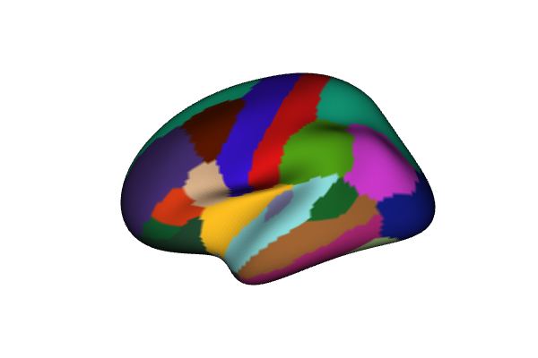
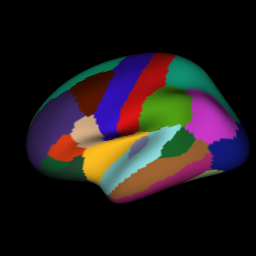
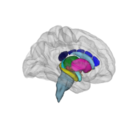
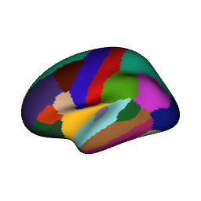
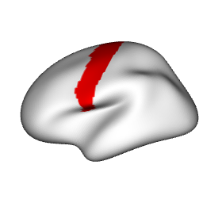
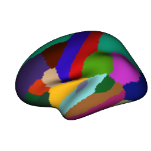

Screenshots from a WebGL viewer get the job done for presentations, but journals
and posters deserve better. `ggsegray()` renders brain atlases into an rgl
scene --- the same mesh data, the same colour pipeline, just a different backend.
Once the scene is in rgl, rayshader's path tracer handles realistic lighting,
soft shadows, and depth of field.

This vignette walks through the full workflow: from a basic rgl scene to a
polished ray-traced figure.

## Setup

You need rgl for the 3D scene and rayshader for the ray tracer. Both are
optional dependencies --- ggseg3d checks for them at runtime.


``` r
library(ggseg3d)
library(dplyr)

# install.packages(c("rgl", "rayshader")) # nolint: commented_code_linter
```


## A first render

`ggsegray()` mirrors the `ggseg3d()` API for atlas, hemisphere, and colour
mapping. The difference: instead of an htmlwidget, you get an rgl window.
Camera, background, glass brain overlays --- all of that comes through the same
pipe functions you already know from the widget side.


``` r
ggsegray(atlas = dk, hemisphere = "left") |>
  pan_camera("left lateral")

rgl::snapshot3d("figures/rayshader-first.png")
rgl::close3d()
```

<div class="figure">

<p class="caption">Left hemisphere of the Desikan-Killiany atlas rendered with rgl.</p>
</div>

This opens an interactive rgl window. Rotate with the mouse, zoom with the
scroll wheel. The camera presets match the ones from `pan_camera()` --- "left
lateral", "right medial", "left superior", and so on.

## Mapping data

Data mapping works identically to `ggseg3d()`. Provide a data frame with a
`region` column, point `colour` at a numeric or categorical variable, and
optionally set a custom palette:


``` r
ggsegray(
  .data = some_data,
  atlas = dk,
  colour = "p",
  hemisphere = "left",
  palette = c("forestgreen" = 0, "white" = 0.05, "firebrick" = 1)
) |>
  pan_camera("left lateral")

rgl::snapshot3d("figures/rayshader-data.png")
rgl::close3d()
```

<div class="figure">

<p class="caption">Data-mapped brain with a custom colour palette in rgl.</p>
</div>

## Quick snapshots with rgl

Before reaching for the ray tracer, grab a fast screenshot with
`rgl::snapshot3d()`:


``` r
p <- ggsegray(atlas = dk, hemisphere = "left") |>
  pan_camera("left lateral")

rgl::snapshot3d("my_brain.png")
rgl::close3d()
```

No ray tracing, no wait. When the angle and lighting look right, switch to
`render_highquality()` for the final version.

## Ray-traced output

Build the scene with `ggsegray()` and pipe functions, then call
`render_highquality()`:


``` r
ggsegray(
  .data = some_data,
  atlas = dk,
  colour = "p",
  hemisphere = "left"
) |>
  pan_camera("left lateral") |>
  set_background("white")

rayshader::render_highquality(
  filename = "figures/rayshader-raytrace.png",
  samples = 64,
  width = 600,
  height = 450
)
rgl::close3d()
```

Higher `samples` means less noise and longer render times. For drafts, 64--128 is
fine. For final figures, 256--512 produces clean results.

## Controlling the camera

Camera presets map to the same positions as the Three.js viewer. Pipe
`pan_camera()` after `ggsegray()`:


``` r
ggsegray(atlas = dk, hemisphere = "left") |>
  pan_camera("left lateral")

rgl::snapshot3d("lateral.png")
rgl::close3d()
```


``` r
ggsegray(atlas = dk, hemisphere = "left") |>
  pan_camera("left medial")

rgl::snapshot3d("medial.png")
rgl::close3d()
```


``` r
ggsegray(atlas = dk, hemisphere = "right") |>
  pan_camera("right superior")

rgl::snapshot3d("superior.png")
rgl::close3d()
```

For a custom viewpoint, pass a numeric vector `c(x, y, z)`:


``` r
ggsegray(atlas = dk, hemisphere = "left") |>
  pan_camera(c(-300, 100, 150))

rgl::snapshot3d("custom_angle.png")
rgl::close3d()
```

Once the rgl window is open, `rgl::view3d()` and `rgl::observer3d()` let you
fine-tune interactively before rendering.

## Lighting

Rayshader controls lighting through `render_highquality()`. The `light_direction`
and `light_altitude` parameters set the angle and elevation of the light source:


``` r
ggsegray(atlas = dk, hemisphere = "left") |>
  pan_camera("left lateral")

rayshader::render_highquality(
  filename = "figures/rayshader-lighting.png",
  samples = 64,
  light_direction = 90,
  light_altitude = 30
)
rgl::close3d()
```

For richer lighting setups --- multiple light sources, coloured lights, area
lights --- pass custom scene elements:


``` r
ggsegray(atlas = dk, hemisphere = "left") |>
  pan_camera("left lateral")

rayshader::render_highquality(
  filename = "custom_light.png",
  samples = 64,
  width = 600,
  height = 450,
  light = FALSE,
  scene_elements = rayrender::sphere(
    x = -300, y = 300, z = 200,
    radius = 50,
    material = rayrender::light(intensity = 80, color = "white")
  ),
  interactive = FALSE
)
rgl::close3d()
```

## Background colour

White backgrounds work for most journals. For posters or slides, a dark
background can look striking. Pipe `set_background()` after `ggsegray()`:


``` r
ggsegray(atlas = dk, hemisphere = "left") |>
  pan_camera("left lateral") |>
  set_background("black")

rgl::snapshot3d("figures/rayshader-dark.png")
rgl::close3d()
```

<div class="figure">

<p class="caption">rgl render with a dark background.</p>
</div>

## Glass brain overlay

Subcortical structures float in space without context. A translucent glass brain
fixes that. Pipe `add_glassbrain()`:


``` r
ggsegray(atlas = aseg) |>
  add_glassbrain(colour = "#CCCCCC", opacity = 0.15) |>
  pan_camera("right lateral")

rgl::snapshot3d("figures/rayshader-glassbrain.png")
rgl::close3d()
```

<div class="figure">

<p class="caption">Subcortical atlas with a translucent glass brain rendered in rgl.</p>
</div>

Lower opacity values make the glass brain more see-through. For subcortical
atlases, 0.1--0.2 tends to give enough context without obscuring the structures
underneath.

## Material properties

`ggsegray()` passes `...` straight to the rgl material
(see `?rgl::material3d` for the full list). This gives you control over
lighting, reflection, and shading without ggseg3d needing to wrap every option.

**Glossy highlights** --- set `specular = "white"` (default is `"black"` for
matte):


``` r
ggsegray(
  atlas = dk,
  hemisphere = "left",
  specular = "white",
  shininess = 100
) |>
  pan_camera("left lateral")

rgl::snapshot3d("figures/rayshader-glossy.png")
```

```
## Warning in rgl::snapshot3d("figures/rayshader-glossy.png"): webshot2::webshot()
## failed; trying rgl.snapshot()
```

``` r
rgl::close3d()
```

<div class="figure">

<p class="caption">Glossy surface with specular highlights.</p>
</div>

**Flat colours (no lighting)** --- set `lit = FALSE` to disable all shading.
Every vertex renders at its exact assigned colour. This is essential for
mask extraction where shadows would contaminate the output:


``` r
highlight <- tibble(
  region = c("precentral"),
  highlight = c("#FF0000")
)

ggsegray(
  .data = highlight,
  atlas = dk,
  hemisphere = "left",
  colour = "highlight",
  na_colour = "#FFFFFF",
  lit = FALSE
) |>
  pan_camera("left lateral") |>
  set_background("white")

rgl::snapshot3d("figures/rayshader-flat.png")
rgl::close3d()
```

<div class="figure">

<p class="caption">Flat colours with no lighting --- exact colour reproduction for masks.</p>
</div>

**Wireframe** --- set `front = "lines"` for a wireframe view of the mesh
geometry:


``` r
ggsegray(
  atlas = dk,
  hemisphere = "left",
  front = "lines"
) |>
  pan_camera("left lateral")

rgl::snapshot3d("figures/rayshader-wireframe.png")
rgl::close3d()
```

<div class="figure">

<p class="caption">Wireframe view of the mesh geometry.</p>
</div>

Any property accepted by `rgl::material3d()` can be passed this way ---
`ambient`, `emission`, `smooth`, `alpha`, `lwd`, and more.

## Going further

Everything below works on any rgl scene produced by `ggsegray()`. Some use
rayshader for rendering, others are plain rgl.

### Depth of field

Depth of field blurs regions away from a focal point, pulling attention to
a specific structure. `render_depth()` applies this as a post-processing step
on a snapshot:


``` r
ggsegray(
  .data = some_data,
  atlas = dk,
  colour = "p",
  hemisphere = "left"
) |>
  pan_camera("left lateral")

rayshader::render_depth(
  filename = "depth_of_field.png",
  focus = 0.5,
  focallength = 200,
  fstop = 4,
  width = 600,
  height = 450
)
rgl::close3d()
```

The `focus` parameter (0--1) controls where the focal plane sits in the depth
buffer. `focallength` and `fstop` control the strength of the blur --- lower
f-stop means shallower depth of field, just like a real camera lens.

### Adding labels

Place text labels directly in the 3D scene with `rgl::text3d()`. These render
alongside the brain mesh in the rgl window and the exported widget:


``` r
ggsegray(atlas = dk, hemisphere = "left") |>
  pan_camera("left lateral")

rgl::text3d(x = -45, y = 10, z = 55, text = "precentral", cex = 0.8)

rgl::snapshot3d("labelled.png")
rgl::close3d()
```

### Camera animation

`rgl::movie3d()` spins the camera around the scene and writes frames to a GIF.
Handy for conference talks or supplementary materials:


``` r
ggsegray(
  .data = some_data,
  atlas = dk,
  colour = "p",
  hemisphere = "left"
) |>
  pan_camera("left lateral")

rgl::movie3d(
  rgl::spin3d(axis = c(0, 1, 0), rpm = 10),
  duration = 3,
  dir = tempdir(),
  movie = "brain_spin",
  type = "gif",
  clean = TRUE
)
rgl::close3d()
```

Adjust `duration` and `rpm` to control length and speed. For higher quality,
use `rayshader::render_movie()` which ray-traces each frame:


``` r
rayshader::render_movie(
  filename = "brain_rotate.mp4",
  frames = 360,
  fps = 30,
  zoom = 0.8,
  phi = 30
)
```

### Combining views

For multi-panel figures, render each view separately and stitch them together
with magick:


``` r
library(magick)

views <- c("left lateral", "left medial", "right lateral", "right medial")
files <- paste0("panel_", gsub(" ", "_", views), ".png")

for (i in seq_along(views)) {
  hemi <- if (grepl("left", views[i])) "left" else "right"

  ggsegray(
    .data = some_data,
    atlas = dk,
    colour = "p",
    hemisphere = hemi
  ) |>
    pan_camera(views[i]) |>
    set_background("white")

  rayshader::render_highquality(
    filename = files[i],
    samples = 256,
    width = 800,
    height = 600
  )

  rgl::close3d()
}

panels <- image_read(files)
combined <- image_montage(panels, geometry = "800x600", tile = "2x2")
image_write(combined, "figure_all_views.png")

file.remove(files)
```

## Workflow summary

A typical publication workflow:

1. **Explore** interactively with `ggseg3d()` in the htmlwidget viewer
2. **Switch** to `ggsegray()` when you have settled on the atlas, data, and
   colour scheme
3. **Draft** with `rgl::snapshot3d()` to iterate on camera angle and lighting
4. **Render** with `render_highquality()` for the final figure
5. **Combine** panels with magick if needed
