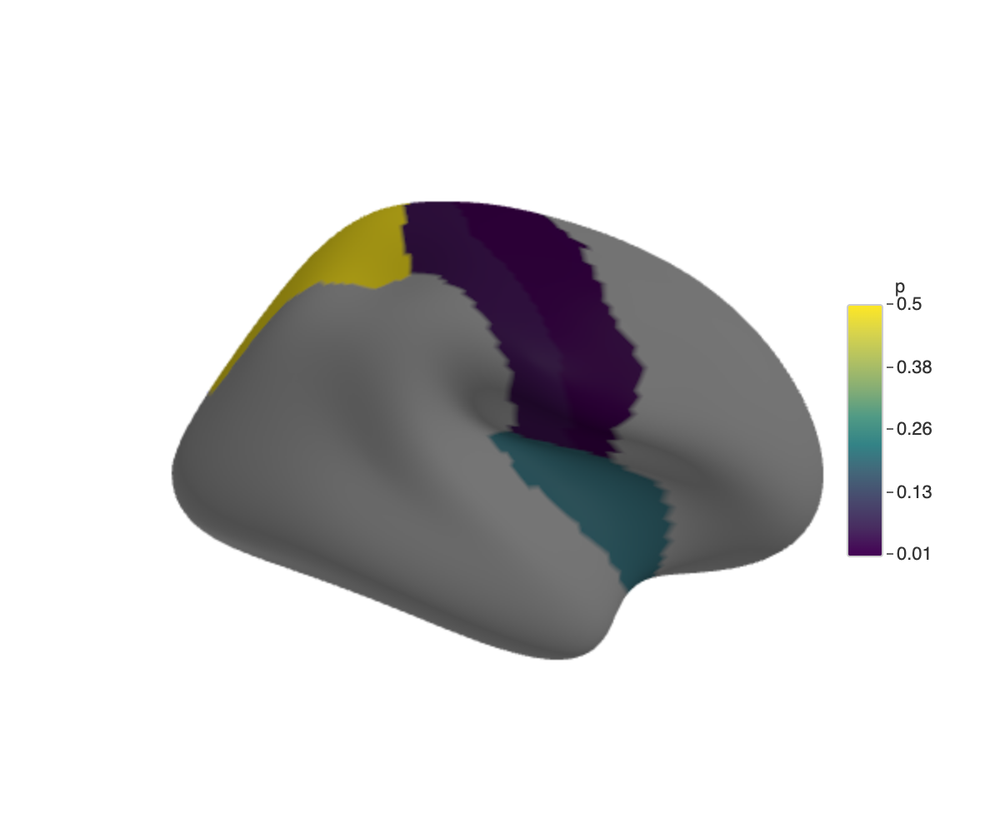
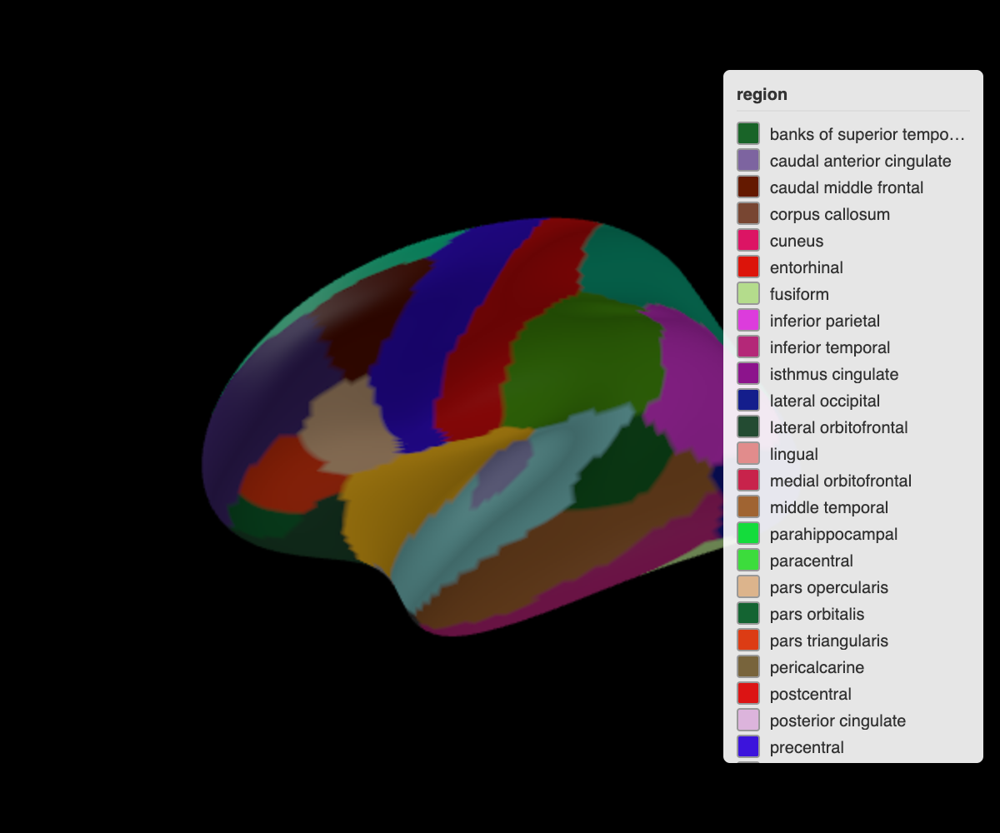

```{r}
#| label: intro-setup
#| include: false
knitr::opts_chunk$set(
  message = FALSE,
  eval = interactive()
)
library(ggseg3d)
library(dplyr)
dir.create("img", showWarnings = FALSE)
```

Brain segmentation results are easier to interpret when they look like a brain.
ggseg3d takes a data frame with region names and renders it as an interactive 3D mesh — rotate, zoom, hover for labels — right in the browser.

## Getting started

```{r}
#| label: intro-basic
#| eval: false
library(ggseg3d)

ggseg3d(hemisphere = "left") |>
  pan_camera("left lateral")
```

```{r}
#| label: intro-snap-basic
#| echo: false
ggseg3d(hemisphere = "left") |>
  pan_camera("left lateral") |>
  snapshot_brain("img/intro-basic.png")
```


With no arguments, `ggseg3d()` plots the Desikan-Killiany atlas.
The output is an htmlwidget: click and drag to rotate, scroll to zoom, hover to see region names.

## Mapping data

Match your data to the atlas by region name, then point `colour_by` at the variable you care about:

```{r}
#| label: intro-plot-data
#| eval: false
library(dplyr)

some_data <- tibble(
  region = c("precentral", "postcentral", "insula", "superior parietal"),
  p = c(0.01, 0.04, 0.2, 0.5)
)

ggseg3d(.data = some_data, atlas = dk(), colour_by = "p", text_by = "p") |>
  pan_camera("right lateral")
```

```{r}
#| label: intro-snap-plot-data
#| echo: false
some_data <- tibble(
  region = c("precentral", "postcentral", "insula", "superior parietal"),
  p = c(0.01, 0.04, 0.2, 0.5)
)

ggseg3d(.data = some_data, atlas = dk(), colour_by = "p", text_by = "p") |>
  pan_camera("right lateral") |>
  snapshot_brain("img/intro-plot-data.png")
```



`text_by = "p"` adds the p-value to the hover tooltip so you can inspect individual regions without a separate table.

## Subcortical atlases

Cortical surfaces are only half the story.
The `aseg` atlas covers subcortical structures, and `add_glassbrain()` wraps them in a translucent cortex for anatomical context:

```{r}
#| label: intro-subcortical
#| eval: false
subcort_data <- tibble(
  region = c("Thalamus", "Caudate", "Hippocampus"),
  p = c(0.2, 0.5, 0.8)
)

ggseg3d(.data = subcort_data, atlas = aseg(), colour_by = "p", na_alpha = .5) |>
  add_glassbrain()
```

```{r}
#| label: intro-snap-subcortical
#| echo: false
subcort_data <- tibble(
  region = c("Thalamus", "Caudate", "Hippocampus"),
  p = c(0.2, 0.5, 0.8)
)

ggseg3d(.data = subcort_data, atlas = aseg(), colour_by = "p", na_alpha = .5) |>
  add_glassbrain() |>
  snapshot_brain("img/intro-subcortical.png")
```


## Camera and background

`pan_camera()` sets the viewing angle.
`set_background()` changes the canvas colour — handy for dark-themed slides:

```{r}
#| label: intro-camera
#| eval: false
ggseg3d(hemisphere = "left") |>
  pan_camera("left lateral") |>
  set_background("black")
```

```{r}
#| label: intro-snap-camera
#| echo: false
ggseg3d(hemisphere = "left") |>
  pan_camera("left lateral") |>
  set_background("black") |>
  snapshot_brain("img/intro-background.png")
```



Camera presets cover the standard anatomical views: `"left lateral"`, `"right medial"`, `"left superior"`, and so on.
For anything else, pass a list with `eye` coordinates.
