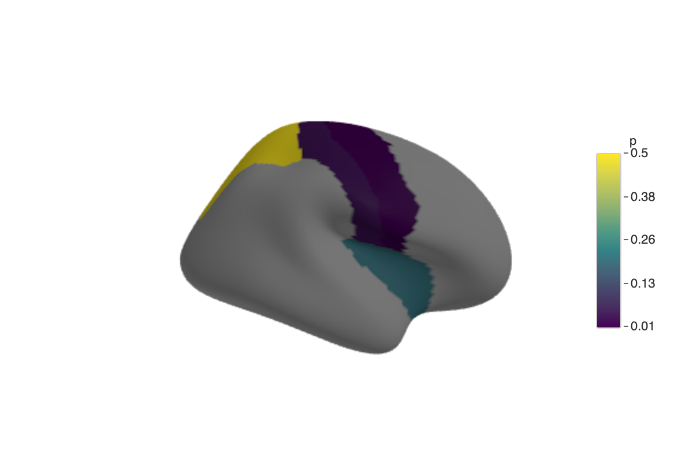
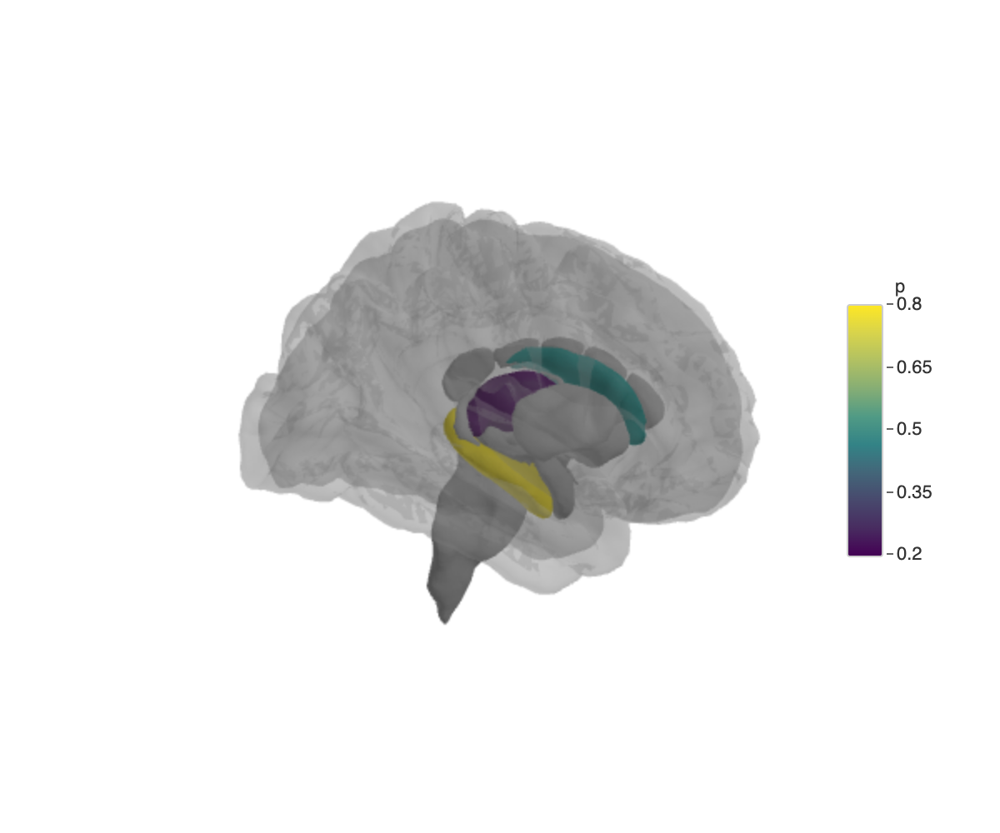
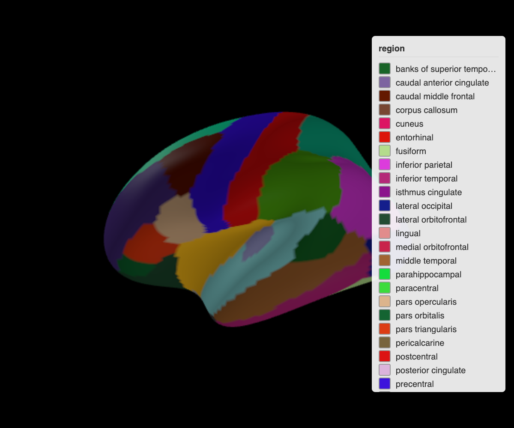

ggseg3d renders interactive 3D brain atlases using WebGL via Three.js.
It provides a pipe-friendly API and unified brain atlases that work with both
ggseg (2D) and ggseg3d (3D).

## Getting started


``` r
library(ggseg3d)

ggseg3d(hemisphere = "left") |>
  pan_camera("left lateral")
```


Call `ggseg3d()` without arguments to plot the default Desikan-Killiany atlas.
The widget is interactive: rotate by clicking and dragging, zoom with the scroll
wheel, and hover over regions to see their names.

## Mapping data

Provide a data frame with a `region` column matching the atlas, and map a
variable to `colour`:


``` r
library(dplyr)

some_data <- tibble(
  region = c("precentral", "postcentral", "insula", "superior parietal"),
  p = c(0.01, 0.04, 0.2, 0.5)
)

ggseg3d(.data = some_data, atlas = dk, colour = "p", text = "p") |>
  pan_camera("right lateral")
```


<div class="figure">

<p class="caption">Brain regions coloured by p-value.</p>
</div>

## Subcortical atlases

For subcortical structures, use the `aseg` atlas and add a translucent glass
brain for anatomical context:


``` r
subcort_data <- tibble(
  region = c("thalamus", "caudate", "hippocampus"),
  p = c(0.2, 0.5, 0.8)
)

ggseg3d(.data = subcort_data, atlas = aseg, colour = "p", na_alpha = .5) |>
  add_glassbrain()
```


<div class="figure">

<p class="caption">Subcortical structures with a translucent glass brain overlay.</p>
</div>

## Camera and background

Use `pan_camera()` to set the viewing angle and `set_background()` to change
the background colour:


``` r
ggseg3d(hemisphere = "left") |>
  pan_camera("left lateral") |>
  set_background("black")
```


<div class="figure">

<p class="caption">Brain atlas with a black background.</p>
</div>

Available presets include `"left lateral"`, `"right medial"`,
`"left superior"`, and more. For custom positions, pass a list with
`eye` coordinates.

## Further reading

- [Full ggseg3d walkthrough](../articles/ggseg3d-walkthrough.html) with all features and examples
- [Ray-traced rendering](../articles/rayshader.html) with lighting, materials, and animation
- [Shiny integration](shiny.html)

